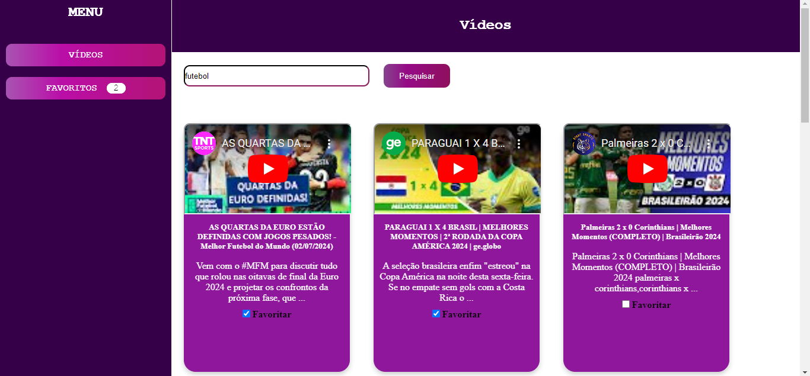

Descrição: Esse projeto tem a funcionalidade de pesquisar vídeos no youtube, nele estão contidas duas páginas: Vídeos, Meus favoritos.
Nesse projeto é possível pesquisar um vídeo através de termos, adicionar e excluir vídeos favoritos.

Como usar: A página inicial da aplicação(Vídeos) contém um input onde o usuário deve digitar um termo/título indicando o vídeo que quer buscar, ao lado está um botão "pesquisar" onde o usuário
irá clickar e obter os resultados do Youtube.
Cada card contendo um vídeo, tem um imagem do vídeo onde é possível exibir o vídeo e logo abaixo contém uma caixinha com o texto "Favoritar" que caso seja clickado, será adicionado
a página de favoritos.

Exemplo abaixo:

Imagem do vídeo pesquisado:

Imagem dos vídeos favoritados:

PS: para usar o projeto, use o comando 'npm i' para instalar todas as dependências.
Rode também o comando node server.mjs no caminho da pasta server.

Exemplo do projeto em funcionamento:

